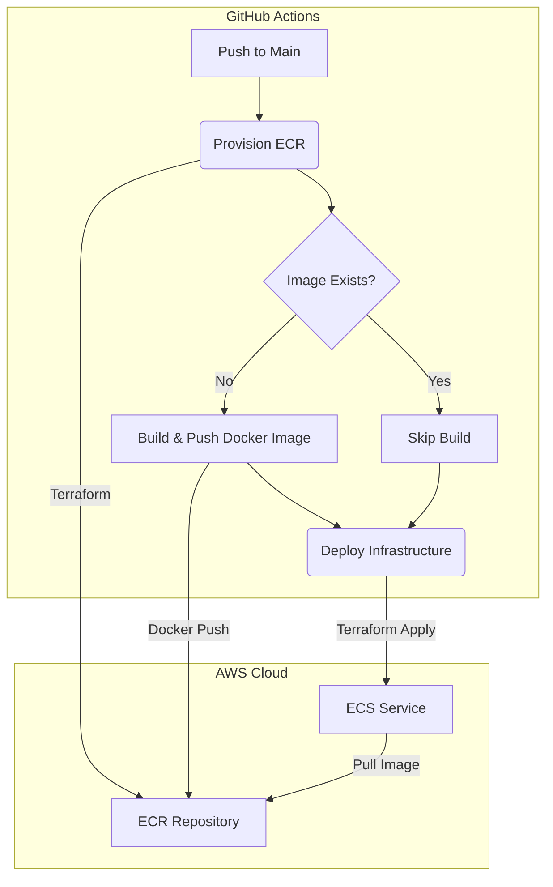
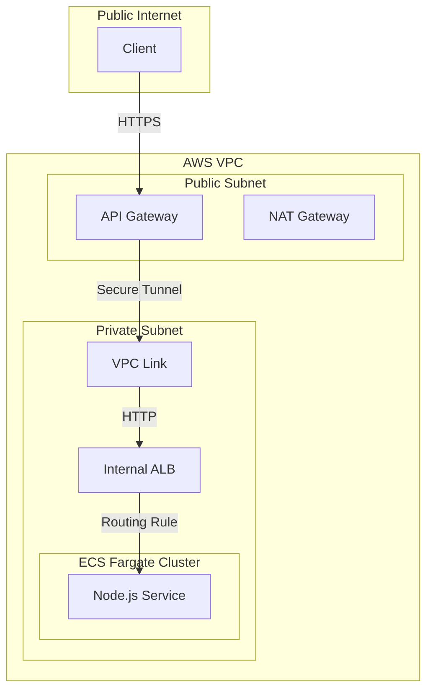

# Node.js Fargate Microservice Template

This template provides a secure, automated framework for deploying a new TypeScript microservice to AWS Fargate using Terraform and GitHub Actions.

---

## 1. Platform Prerequisites (One-Time Manual Setup)

These resources form the secure, shared foundation for your entire platform and must be created in the AWS console before the first automated deployment.
acme is just a placeholder name for your company or organization.

### 1.1 Secure State Management (S3 & DynamoDB)

These components store and lock your Terraform state.

| Component | Action Required in AWS | Requirements |
| :--- | :--- | :--- |
| **S3 State Backend** | Create a new S3 bucket. | **Globally Unique Name** (e.g., `acme-tf-state-prod-2025`). **Versioning** and **SSE-S3 Encryption** must be enabled. |
| **DynamoDB Lock Table** | Create a new DynamoDB table. | **Name** must match your desired secret value (e.g., `acme-tf-locks`). **Primary Key** must be named `LockID` (case-sensitive, String type). |

### 1.2 Secure Identity Setup (OIDC & IAM Role)

This establishes the trust for your GitHub Actions deployment.

| Component | Action Required in AWS | Details |
| :--- | :--- | :--- |
| **OIDC Trust Provider**| Go to IAM > Identity providers > **Add provider**. | **Provider Type:** OpenID Connect. **Provider URL:** `https://token.actions.githubusercontent.com`. **Audience:** `sts.amazonaws.com`. |
| **Deployment IAM Role** | Create a new IAM Role. | **Trusted Entity:** Choose **Web identity**, select the OIDC provider, and refine the **Trust Policy JSON** to restrict access to your specific GitHub repository path (`repo:TheBitDrifter/...:*`). |

---

## 2. Deployment Setup (OIDC & Secrets)

Deployment is automated via GitHub Actions using **OIDC** for secure authentication.

### 2.1 GitHub Secrets Configuration

 Store the following **Secrets** in your repository settings (**Settings > Secrets and variables > Actions > Secrets**):

 | Secret Name | Purpose | Value Example |
 | :--- | :--- | :--- |
 | **`AWS_OIDC_ROLE_ARN`** | The IAM role the workflow will assume for deployment permissions. | `arn:aws:iam::[ACCOUNT_ID]:role/GitHubActionsDeployer` |

### 2.2 GitHub Variables Configuration

 Store the following **Variables** in your repository settings (**Settings > Secrets and variables > Actions > Variables**):

 | Variable Name | Purpose | Value Example |
 | :--- | :--- | :--- |
 | **`AWS_REGION`** | Specifies the deployment region. | `us-east-1` |
 | **`S3_STATE_BUCKET_NAME`** | **The name of the S3 bucket created for Terraform state.** | `acme-tf-state-prod-2025` |
 | **`DYNAMODB_LOCK_TABLE`** | **The name of the DynamoDB table for state locking.** | `acme-tf-locks` |
 | **`SERVICE_ALIAS`** | A short, unique identifier for your service (used for naming). | `user-api` |

### 2.3 Environment Handling

This template supports multi-environment deployments (`staging`, `prod`):

*   **State Isolation**: Each environment stores its state at `services/<environment>/<service>.tfstate`.
*   **Resource Naming**: Resources include the environment suffix (e.g., `user-api-staging-ecs-service`).
*   **Shared ECR**: The ECR repository is **shared** across environments:
    *   **Staging** creates the repository.
    *   **Prod** reads the existing repository.
    *   This follows the "Build Once, Deploy Anywhere" principle.

> [!WARNING]
> **Destruction Risk**: If you destroy the **staging** environment, the ECR repository (and all images) will be deleted, affecting prod.

### 2.4 Deployment Flow

**When deploying:**
1.  Select the target **environment** (`staging` or `prod`).
2.  **Provision ECR:** Terraform ensures the ECR repository exists (creates if staging, looks up if prod).
3.  **Build & Push:** Checks if the image (tagged with Git SHA) exists. If not, builds and pushes it.
4.  **Deploy:** Terraform updates the ECS Service to use the new image tag.

**State is stored at:** `services/<environment>/<service_alias>.tfstate`

---

## 3. Quick Start & Local Development

1. **Clone** this repository.
2. **Install Dependencies:** `npm install`
3. **Compile Code:** `npm run build`
4. **Run Locally:** `npm start` (Runs the compiled `dist/server.js`)
5. **Test Health Check:** `curl http://localhost:3000/health`

---

## 4. Architecture and Components
 
 This setup follows a **Shared Platform** architecture:
 
 1.  **Platform (Shared):** The VPC, ALB, and ECS Cluster are deployed **once** (via `aws-fargate-platform-template`).
 2.  **Service (This Repo):** This template deploys **only** the service-specific resources (Task Definition, Service, Target Group) and plugs them into the shared platform.
 
 > [!NOTE]
 > **Decoupled Architecture**
 >
 > This template uses `terraform_remote_state` to fetch the IDs of the shared platform (VPC ID, Cluster ID, etc.) from S3. It does **not** create a new VPC.

| Component | Purpose (Operational Focus) |
| :--- | :--- |
| **API Gateway / VPC Link** | The **single, public entry point** that uses a secure tunnel to reach the private network. |
| **Internal ALB** | The shared, private load balancer that distributes traffic only to healthy tasks. |
| **ECS Task Definition** | The blueprint for your container, consuming the immutable image from ECR. |
| **Private Subnets** | All application tasks are placed here, **isolated** from direct internet access. |
